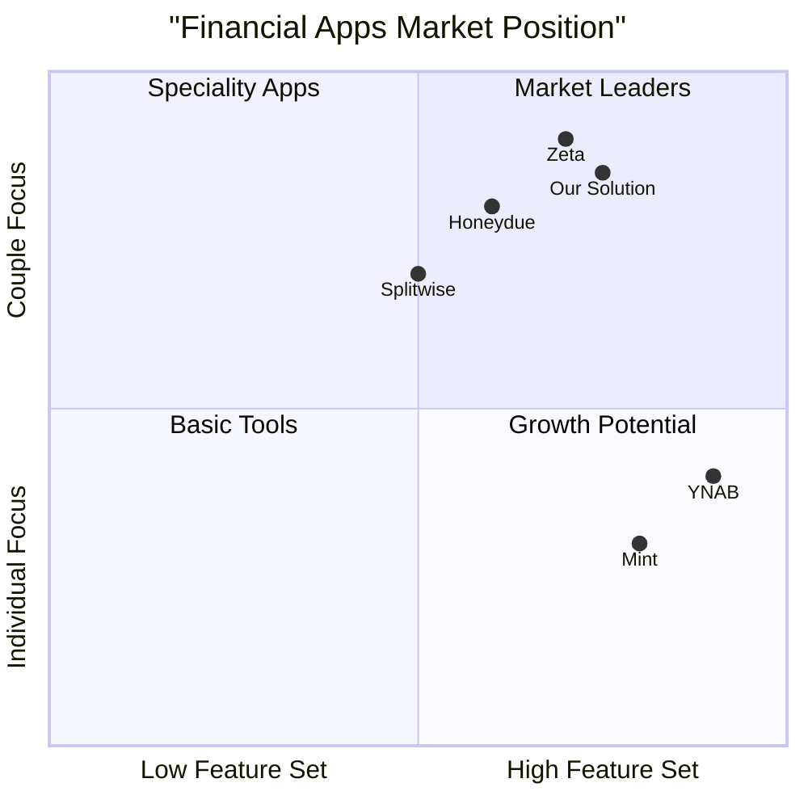

# Product Requirements Document: Couples Financial Control System

## 1. Project Overview

### 1.1 Programming Language & Technology Stack
- Frontend: React, TypeScript, Tailwind CSS
- Backend: Java 17, Spring Boot 3.2.3
- Database: PostgreSQL (via Supabase)

### 1.2 Original Requirements
Develop a comprehensive financial control system for couples with the following features:
- User authentication
- Shared accounts management
- Transaction tracking
- Expense categorization
- Dashboard with charts

## 2. Product Goals
1. Empower couples to manage shared finances collaboratively and transparently
2. Simplify expense tracking and categorization for better financial planning
3. Provide clear financial insights through intuitive visualizations and reports

## 3. User Stories

### 3.1 Authentication & Account Management
As a user, I want to:
- Register with email/password to create a personal account
- Invite my partner to create a shared financial space
- Manage profile settings and notification preferences
- Reset password through email verification

### 3.2 Transaction Management
As a couple member, I want to:
- Add income and expense transactions with descriptions and categories
- View a shared transaction history with my partner
- Filter transactions by date, category, and type
- Edit or delete transactions I've created

### 3.3 Financial Dashboard
As a couple member, I want to:
- View our current balance and spending trends
- See expense distribution across different categories
- Track monthly income vs. expenses
- Export financial reports for specific periods

## 4. Competitive Analysis

### 4.1 Market Analysis



### 4.2 Competitor Analysis

1. **Honeydue**
   - Pros:
     * Built specifically for couples
     * Bank account integration
     * Bill reminders
   - Cons:
     * Limited customization
     * Basic reporting features
     * US-focused

2. **Splitwise**
   - Pros:
     * Easy expense splitting
     * Multi-currency support
     * Group expense tracking
   - Cons:
     * No comprehensive financial planning
     * Limited investment tracking
     * No savings goals

3. **YNAB (You Need A Budget)**
   - Pros:
     * Detailed budgeting
     * Educational resources
     * Strong community
   - Cons:
     * Expensive subscription
     * Steep learning curve
     * Not couple-focused

4. **Mint**
   - Pros:
     * Free to use
     * Bank integration
     * Investment tracking
   - Cons:
     * Ads in app
     * No shared account features
     * US-only bank sync

5. **Zeta**
   - Pros:
     * Joint account features
     * Bill tracking
     * Couple-focused design
   - Cons:
     * Limited availability
     * Basic reporting
     * No investment tracking

## 5. Technical Requirements

### 5.1 Frontend Requirements (P0)
- Responsive web interface supporting desktop and mobile devices
- Real-time updates using WebSocket
- Client-side data validation
- PWA support for offline functionality
- Modular component architecture

### 5.2 Backend Requirements (P0)
- RESTful API implementation
- JWT-based authentication
- Role-based access control
- Database transaction management
- API rate limiting

### 5.3 Database Requirements (P0)
- Secure user data storage
- Transaction history retention
- Data backup and recovery
- Audit logging

### 5.4 Security Requirements (P0)
- End-to-end encryption for sensitive data
- HTTPS enforcement
- Password hashing
- Session management
- XSS and CSRF protection

### 5.5 Optional Features (P1)
- Bank account integration
- Export to PDF/Excel
- Email notifications
- Recurring transactions
- Budget planning tools

### 5.6 Future Enhancements (P2)
- Mobile apps (iOS/Android)
- Investment tracking
- AI-powered insights
- Bill splitting calculator
- Savings goals tracking

## 6. UI Design Draft

### 6.1 Dashboard Layout
```
+------------------+
|     Header       |
+------------------+
|  Quick Stats     |
+------------------+
| Charts | Recent  |
|       | Trans.  |
+------------------+
|   Transaction    |
|     History      |
+------------------+
```

### 6.2 Key Components
1. **Header**
   - Logo
   - User profile
   - Navigation menu
   - Settings

2. **Quick Stats**
   - Current balance
   - Monthly income
   - Monthly expenses
   - Savings rate

3. **Charts Section**
   - Expense categories (pie chart)
   - Income vs. Expenses (bar chart)
   - Spending trends (line chart)

4. **Transaction List**
   - Date
   - Description
   - Amount
   - Category
   - Added by (user)

### 6.3 Key Interactions
- Drag-and-drop categorization
- Click-to-edit transactions
- Swipe actions on mobile
- Filter/sort controls
- Date range selector

## 7. Open Questions

1. **Technical Considerations**
   - Should we implement real-time sync between partners?
   - What level of offline support is needed?
   - How should we handle currency conversions?

2. **Business Questions**
   - What is the target price point?
   - Should we offer a free tier?
   - What are the key metrics for success?

3. **User Experience**
   - How to handle disagreements on categorization?
   - What notification preferences should be available?
   - How to handle shared vs. personal expenses?

## 8. Success Metrics

### 8.1 Key Performance Indicators
- User registration rate
- Partner invitation acceptance rate
- Daily active users
- Transaction entry frequency
- User retention rate

### 8.2 Technical Metrics
- API response time
- System uptime
- Error rate
- Database performance

### 8.3 Business Metrics
- User acquisition cost
- Conversion rate
- Customer lifetime value
- Feature adoption rate

## 9. Timeline and Milestones

### Phase 1 (MVP) - 3 months
- Basic user authentication
- Transaction management
- Simple dashboard
- Essential reports

### Phase 2 - 2 months
- Advanced analytics
- Bank integration
- Notification system
- Mobile responsiveness

### Phase 3 - 2 months
- AI insights
- Investment tracking
- API for third-party integration
- Advanced reporting

---

## Appendix

### A1. Glossary
- Transaction: Any financial movement (income or expense)
- Category: Predefined or custom grouping for transactions
- Shared Account: Financial space shared between partners
- Dashboard: Main view showing financial overview

### A2. Technical Stack Details
- Frontend: React 18+, TypeScript 4+
- Backend: Java 17, Spring Boot 3.2.3
- Database: PostgreSQL 12+
- Authentication: JWT + Spring Security
- Cloud: AWS/GCP

### A3. Security Compliance
- GDPR compliance
- Data encryption at rest
- Regular security audits
- Automated backup system
